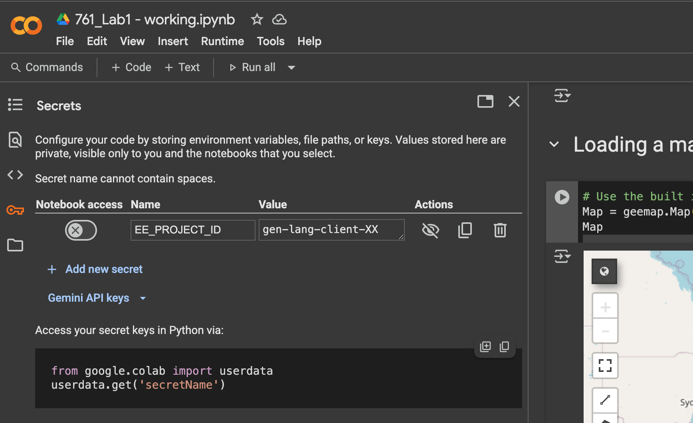

# Overview

This repo contains all lab and my personal solutions for the course `GEOG 761: Special Topic: Monitoring Change from Space with Machine Learning - The University of Auckland`

# Setup

## Desktop IDE - VS Code

### Google Earth Engine Euthentication

Run:

```bash
conda install -c conda-forge earthengine-api
earthengine authenticate

# If you want to revoke authorization on your desktop, simply delete the credentials file here.
ls $HOME/.config/earthengine/credentials
```

More info: https://developers.google.com/earth-engine/guides/python_install-conda

### Environment data

- Save as the file `.env.sample` to `.env`
- Replace 'gen-lang-client-xxxxxxxx' with your actual Google Earth Engine Project ID

```bash
EE_PROJECT_ID=gen-lang-client-xxxxxxxx
```

## Colab

For colab, dependencies are installed, no need to follow.

Authentication request also promts when you execute the notebook.

Create approriate secret `EE_PROJECT_ID`, using your Google Earth Engine Project as them image below.

